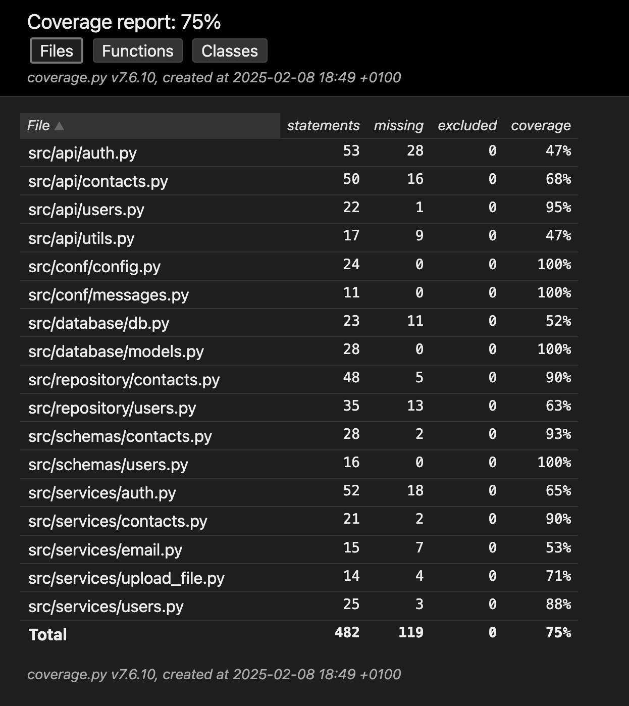
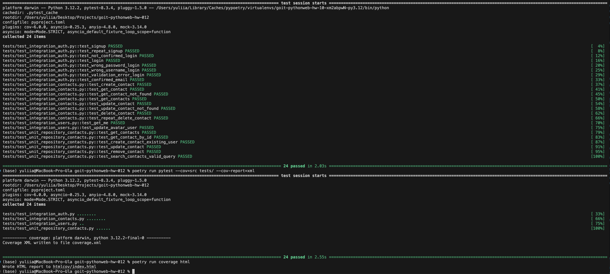
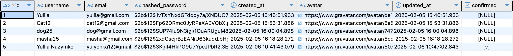

# Фінальне домашнє завдання

Вітаємо, друзі! 🙂 ✋🏼

Ось позаду навчання на курсі **FullStack Web Development with Python**, і ви на
порозі фінального домашнього завдання, яке стане підсумком і закріпленням усіх
ваших знань, умінь і навичок, здобутих під час проходження курсу.

У цьому фінальному домашньому завданні ви маєте **допрацювати ваш REST API
застосунок** з попередніх домашніх завдань.

## Технічний опис завдання

- **Створення документації за допомогою Sphinx.** За допомогою Sphinx створіть
  документацію для вашого застосунку. Для цього додайте в основних модулях до
  необхідних функцій і методів класів рядки `docstrings`.
- **Модульне тестування.** Покрийте модульними тестами модулі репозиторію вашого
  застосунку.
- **Інтеграційне тестування.** Покрийте інтеграційними тестами маршрути вашого
  застосунку, використовуючи фреймворк `pytest`.
- **Покриття тестами понад 75%.** Покрийте ваш застосунок тестами на понад 75%.
  Для контролю використовуйте пакет `pytest-cov`.
- **Реалізація кешування з Redis.** Реалізуйте механізм кешування за допомогою
  бази даних Redis. Виконайте кешування поточного користувача під час
  авторизації, щоб функція `get_current_user` брала користувача з кешу і не
  зверталася щоразу до бази даних.
- **Механізм скидання пароля.** Реалізуйте механізм скидання пароля для
  застосунку REST API.
- **Ролі користувачів і доступ.** Реалізуйте для користувачів застосунку доступ
  за ролями: «user» та «admin». Забезпечте, щоб тільки адміністратори могли
  самостійно змінювати свій аватар за замовчуванням.

> [!NOTE]
>
> 👉🏻Останні три завдання ви не виконували раніше в межах домашніх робіт, проте
> ці аспекти докладно висвітлені в конспекті. За потреби не вагайтеся звернутися
> по допомогу до ментора.

### Додаткові завдання (не обов'язкові)

> [!NOTE]
>
> 👉🏻Наступні завдання не є обов'язковими, але можуть принести вам додаткові
> бали.

- **Пара токенів** `access_token` і `refresh_token`. Реалізуйте механізм
  авторизації застосунку за допомогою JWT токенів, використовуючи пару токенів:
  токен доступу access_token і токен оновлення refresh_token.
- **Розгортання у хмарному сервісі.** Виконайте розгортання свого застосунку у
  хмарному сервісі на ваш вибір.

## Загальні вимоги до виконання домашнього завдання

> [!TIP]
>
> 👉🏻 Вимоги до домашнього завдання є обов’язковою умовою оцінювання домашнього
> завдання ментором. Якщо якусь із вимог не виконано, ментор надішле ДЗ на
> доопрацювання без оцінювання. Якщо вам «тільки уточнити»😉 або ви
> застопорилися на якомусь з етапів виконання — звертайтеся до ментора у Slack).

1. **Документація коду.**

Усі основні функції та методи класів повинні мати відповідні `docstrings` для
генерації документації за допомогою Sphinx.

2. **Тестування.**

Тестові модулі повинні бути організовані відповідно до структури вашого
застосунку. Використовуйте `pytest` для написання модульних та інтеграційних
тестів. Забезпечте покриття тестами не менше 75% коду застосунку. Використовуйте
`pytest-cov` для перевірки покриття.

3. **Кешування з Redis.**

Налаштуйте Redis як сервіс кешування для вашого застосунку. При реалізації
кешування користувача забезпечте безпеку та актуальність даних.

4. **Скидання пароля.**

Реалізуйте безпечний механізм скидання пароля з підтвердженням через електронну
пошту або іншим способом.

5. **Керування ролями.**

Впровадьте систему ролей для користувачів. Забезпечте перевірку прав доступу при
виконанні операцій, доступних лише адміністраторам.

6. **Збереження конфіденційних даних.**

Усі конфіденційні дані та налаштування повинні зберігатися у файлі `.env`. Не
включайте конфіденційні дані в кодову базу.

7. **Контейнеризація.**

Використовуйте Docker Compose для запуску всіх сервісів і баз даних вашого
застосунку.

### Додаткові вимоги (для додаткових завдань)

1. **JWT токени.**

Реалізуйте безпечний механізм оновлення токенів доступу за допомогою
`refresh_token`.

2. **Розгортання у хмарі**.

- Забезпечте коректну роботу вашого застосунку після розгортання в обраному
  хмарному сервісі.
- Надішліть посилання на робочий застосунок.

## Підготовка та завантаження домашнього завдання

1. Створіть публічний репозиторій `goit-pythonweb-hw-12`.

2. Виконайте завдання та відправте його у свій репозиторій.

3. Завантажте робочі файли на свій комп’ютер і прикріпіть їх в LMS у форматі
   zip. Назва архіву повинна бути у форматі ДЗ12_ПІБ.

4. Прикріпіть посилання на репозиторій `goit-pythonweb-hw-12` та відправте на
   перевірку.

## Формат оцінювання

Оцiнка вiд 0 до 100.

Реалізація основних вимог оцінюється у 100 балів:

- Створення документації за допомогою Sphinx оцінюється у 15 балів.
- Модульне тестування оцінюється у 15 балів.
- Інтеграційне тестування оцінюється у 20 балів.
- Покриття тестами понад 75% оцінюється в 10 балів.
- Реалізація кешування з Redis оцінюється у 15 балів.
- Механізм скидання пароля оцінюється у 15 балів.
- Ролі користувачів і доступ оцінюються в 10 балів.

Реалізація додаткових вимог оцінюється в додаткові 40 балів, але сумарна оцінка
не може бути більшою 100:

- Реалізація механізму авторизації застосунку за допомогою JWT токенів з
  використанням пари токенів оцінюється у 20 балів.
- Розгортання у хмарному сервісі оцінюється у 20 балів.

> [!IMPORTANT]
>
> Якщо є помилки або недоліки виконання, кількість балів зменшується пропорційно
> до наявних помилок на розсуд ментора.

> [!WARNING]
>
> 👉🏻 УВАГА!!
>
> У вас є можливість обрати підхід до виконання та можливого доопрацювання
> домашнього завдання:
>
> 1. задовольнитися першою отриманою оцінкою (звісно ж, якщо вона вища за
>    прохідний бал),
> 2. намагатися отримати вищий бал шляхом можливого подальшого доопрацювання
>    роботи відповідно до фідбеку ментора.
>
> Обраний підхід до виконання ДЗ необхідно зазначити в полі для здачі до
> прикріпленого завдання. За відсутності коментаря ментор дотримується першого
> підходу й виставляє отриману оцінку.

> [!CAUTION]
>
> 👉🏻Відправляйте ДЗ на перевірку, коли зроблено все можливе, адже кількість
> спроб здачі завдання впливає на отриманий бал! За кожну наступну спробу після
> другої (тобто з третьої) максимально можлива кількість балів зменшується на 5.
> Критерії оцінювання робіт у магістратурі GoIt Neoversity

## Формат здачі

- Прикріплені файли репозиторію у форматі `zip` з назвою ДЗ12_ПІБ.
- Посилання на репозиторій.

### Результати виконаного завдання:

